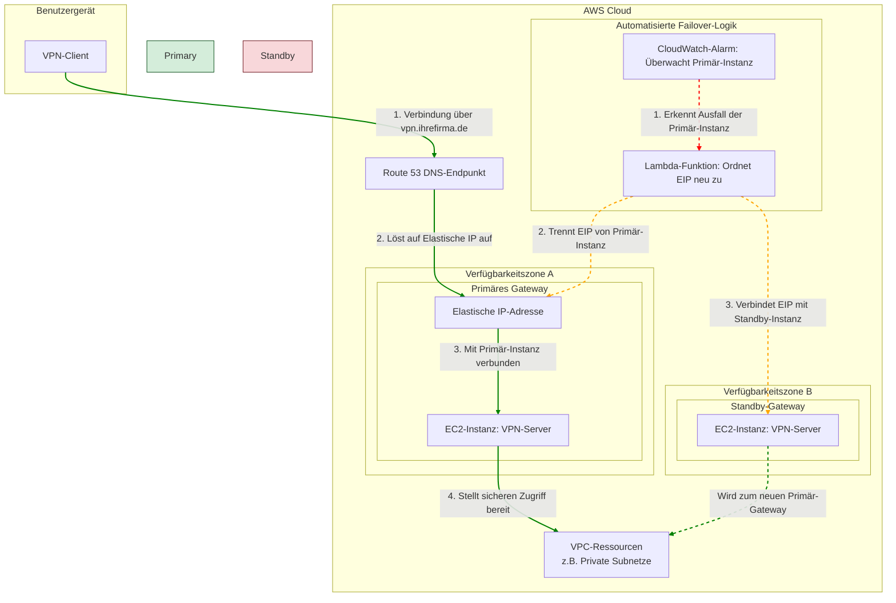

# 🛡️ Stärkung des Fernzugriffs: Hochverfügbares und sicheres VPN-Gateway


> Eine Anleitung zur Bereitstellung eines hochverfügbaren IPsec/OpenVPN-Clusters auf AWS, entwickelt für außergewöhnliche Ausfallsicherheit und verstärkt durch Multi-Faktor-Authentifizierung. Diese Lösung bietet sicheren, zuverlässigen und performanten Fernzugriff für eine moderne Belegschaft.

---

## 🎯 Die Herausforderung: Die Fragilität von Standard-Fernzugriffslösungen

Im Zeitalter der Telearbeit ist der Zugang zu internen Ressourcen unerlässlich. Standard-VPN-Lösungen bergen jedoch oft erhebliche Risiken und Engpässe:

*   **Single Point of Failure:** Der Ausfall eines einzigen VPN-Servers kann die Produktivität der gesamten Belegschaft zum Erliegen bringen.
*   **Sicherheitslücken:** Einfacher, auf Anmeldedaten basierender Zugriff ist ein Hauptziel für Angreifer und entbehrt der Robustheit moderner Authentifizierungsmethoden.
*   **Performance-Engpässe:** Ein einzelnes, überlastetes Gateway kann zu langsamen Verbindungsgeschwindigkeiten und einer schlechten Benutzererfahrung führen.
*   **Reaktive Wartung:** Oft ist manuelles Eingreifen erforderlich, um Ausfälle zu beheben, was zu längeren Ausfallzeiten führt.

Sich auf eine fragile Einzelserver-Konfiguration zu verlassen, ist für geschäftskritische Abläufe keine tragfähige Strategie mehr.

## ✨ Die Lösung: Ein automatisiertes, ausfallsicheres und sicheres Gateway

Dieses Projekt implementiert eine mehrschichtige Defense-in-Depth-Strategie für den Fernzugriff, die Hochverfügbarkeit, Sicherheit und Leistung in den Vordergrund stellt.

1.  **Für Ausfallsicherheit konzipiert:** Bereitstellung eines Clusters von VPN-Servern über mehrere Availability Zones, um Single Points of Failure zu eliminieren.
2.  **Absicherung der Zugänge:** Erzwingung der Multi-Faktor-Authentifizierung (MFA), um sicherzustellen, dass nur autorisierte Benutzer eine Verbindung herstellen können.
3.  **Automatisierung für Zuverlässigkeit:** Implementierung eines automatisierten Failover-Mechanismus, der Serverausfälle erkennt und den Datenverkehr in Echtzeit ohne menschliches Eingreifen umleitet.
4.  **Optimierung für Leistung:** Sorgfältige Abstimmung der Netzwerk- und Serverkonfigurationen, um maximalen Durchsatz für alle verbundenen Benutzer zu erreichen.

## 🚀 Hauptmerkmale & Architektur-Highlights

*   ✅ **Hochverfügbarkeits-Cluster:** Eine Aktiv-Passiv-Konfiguration des VPN-Gateways, die sich über mehrere AWS Availability Zones erstreckt, gewährleistet eine nahezu kontinuierliche Verfügbarkeit.
*   ✅ **Automatisierter Failover-Mechanismus:** Proaktive **AWS CloudWatch-Alarme** überwachen den Zustand des primären Gateways. Bei Ausfallerkennung wird eine **AWS Lambda**-Funktion ausgelöst, die sofort die **Route 53** DNS-Einträge aktualisiert und den gesamten Verkehr auf die fehlerfreie Standby-Instanz umleitet.
*   ✅ **Verstärkte Sicherheit mit MFA:** Integration mit MFA-Lösungen, um eine kritische Sicherheitsebene über den reinen Benutzernamen und das Passwort hinaus hinzuzufügen und vor dem Diebstahl von Anmeldedaten zu schützen.
*   ✅ **Optimiert für maximalen Durchsatz:** Server- und Netzwerkeinstellungen wurden optimiert, um eine hohe Anzahl gleichzeitiger Verbindungen ohne Leistungseinbußen zu bewältigen.
*   ✅ **Zentralisierte & sichere Konnektivität:** Bietet einen einzigen, sicheren Zugangspunkt zu Ihrer AWS VPC und vereinfacht so die Netzwerkverwaltung und Zugriffskontrolle.

## 💻 Verwendete Kerntechnologien

| Technologie | Zweck |
| --- | --- |
| **Amazon EC2** | Hostet die OpenVPN/IPsec-Serverinstanzen. |
| **Amazon VPC** | Stellt die isolierte Netzwerkumgebung für die Infrastruktur bereit. |
| **AWS Route 53** | Verwaltet das DNS-Routing und ermöglicht den schnellen Failover-Mechanismus. |
| **AWS CloudWatch** | Überwacht den Serverzustand und löst bei Ausfallerkennung Alarme aus. |
| **AWS Lambda** | Führt die automatisierte Failover-Logik zur Aktualisierung der DNS-Einträge aus. |
| **OpenVPN / IPsec**| Die Kern-VPN-Protokolle, die sichere Kommunikationstunnel bereitstellen. |
| **MFA-Anbieter** | Integration mit Diensten wie Google Authenticator oder Duo für 2FA. |

---

## 🏗️ Architekturübersicht

Die Architektur ist auf automatisierte Ausfallsicherheit ausgelegt. Die Hauptkomponenten arbeiten zusammen, um eine nahtlose Benutzererfahrung zu gewährleisten, selbst im Falle eines Serverausfalls.

1.  **Normalbetrieb (Steady State):** Benutzer verbinden sich über einen zentralen, von Route 53 verwalteten DNS-Endpunkt mit dem VPN-Gateway. Dieser Endpunkt verweist auf die Elastic-IP-Adresse der **primären EC2-Instanz**.
2.  **Ausfallerkennung:** Ein CloudWatch-Alarm überwacht kontinuierlich den Zustand der primären Instanz. Wenn diese nicht mehr reagiert (z. B. aufgrund eines Instanzausfalls oder von Netzwerkproblemen), ändert sich der Alarmzustand.
3.  **Automatisierter Failover:** Der CloudWatch-Alarm löst eine Lambda-Funktion aus. Diese Funktion löst automatisch die Zuordnung der Elastic IP von der ausgefallenen primären Instanz und ordnet sie der **Standby-EC2-Instanz** neu zu.
4.  **Dienstwiederherstellung:** Die Standby-Instanz übernimmt die Funktion des neuen primären Gateways. Da die Elastic IP verschoben wird, können Benutzer sich über denselben DNS-Endpunkt erneut verbinden, ohne ihre Konfiguration ändern zu müssen. Der Failover ist in der Regel in weniger als 90 Sekunden abgeschlossen.



---

## 🛠️ Konfiguration & Bereitstellung

Dieses Projekt kann mit den bereitgestellten Infrastructure-as-Code-Skripten bereitgestellt werden.

**1. Klonen Sie das Repository:**
```bash
git clone https://github.com/your-username/ha-secure-vpn.git
cd ha-secure-vpn
```

**2. Konfigurieren Sie die Umgebung:**
Aktualisieren Sie die Konfigurationsdateien im Verzeichnis `/terraform` oder `/cloudformation` mit Ihren spezifischen VPC-, Subnetz- und AMI-Details.

**Beispiel: Wichtige OpenVPN-Konfiguration (`/scripts/server.conf`)**
```ini
port 1194
proto udp
dev tun

# Zertifikate und Schlüssel
ca ca.crt
cert server.crt
key server.key
dh dh.pem

# Sicherheit & MFA
plugin /usr/lib/openvpn/openvpn-plugin-auth-pam.so login
reneg-sec 0

# Routen an Clients pushen
push "route 10.10.10.0 255.255.255.0"
```

**3. Stellen Sie die Infrastruktur bereit:**
Folgen Sie den Anweisungen im entsprechenden IaC-Verzeichnis, um den Stack bereitzustellen.

## 📈 Wichtige Ergebnisse & Auswirkungen

Diese Lösung verwandelt eine standardmäßige, anfällige Fernzugriffskonfiguration in ein sicheres Gateway auf Unternehmensniveau.

| Vorher | Nachher |
| --- | --- |
| Einzelner Ausfallpunkt | **Hochverfügbarkeit mit einer geplanten Verfügbarkeit von 99,9 %** |
| Nur-Passwort-Authentifizierung | **Verstärkt durch Multi-Faktor-Authentifizierung (MFA)** |
| Manueller Failover-Prozess (Stundenlange Ausfallzeit) | **Automatisierter Failover (< 90 Sekunden)** |
| Potentielle Performance-Engpässe | **Optimiert für maximalen Durchsatz & gleichzeitige Benutzer** |
| Hohes Risiko unbefugten Zugriffs | **Angriffsfläche signifikant reduziert** |

## 📁 Verzeichnisstruktur

```
/ha-secure-vpn
│
├── terraform/                # Terraform-Skripte für die automatisierte Bereitstellung
│   ├── main.tf
│   ├── variables.tf
│   └── outputs.tf
│
├── scripts/                  # Konfigurations- und Hilfsskripte
│   ├── setup_vpn.sh
│   └── server.conf           # Beispiel für OpenVPN-Serverkonfiguration
│
├── lambda/                   # Quellcode für die Failover-Lambda-Funktion
│   └── failover_handler.py
│
├── docs/
│   └── architecture-detailed.png # Detailliertes Architekturdiagramm
│
└── README.md                 # Sie sind hier!
```

## 🤝 Mitwirken

Dies ist ein Portfolio-Projekt, das Best Practices in Cloud-Architektur und Sicherheit demonstriert. Vorschläge, Fragen und Feedback sind sehr willkommen. Bitte zögern Sie nicht, ein Issue zu eröffnen, um Verbesserungen zu diskutieren.

## 📜 Lizenz

Dieses Projekt ist unter der MIT-Lizenz lizenziert. Details finden Sie in der Datei `LICENSE`.
